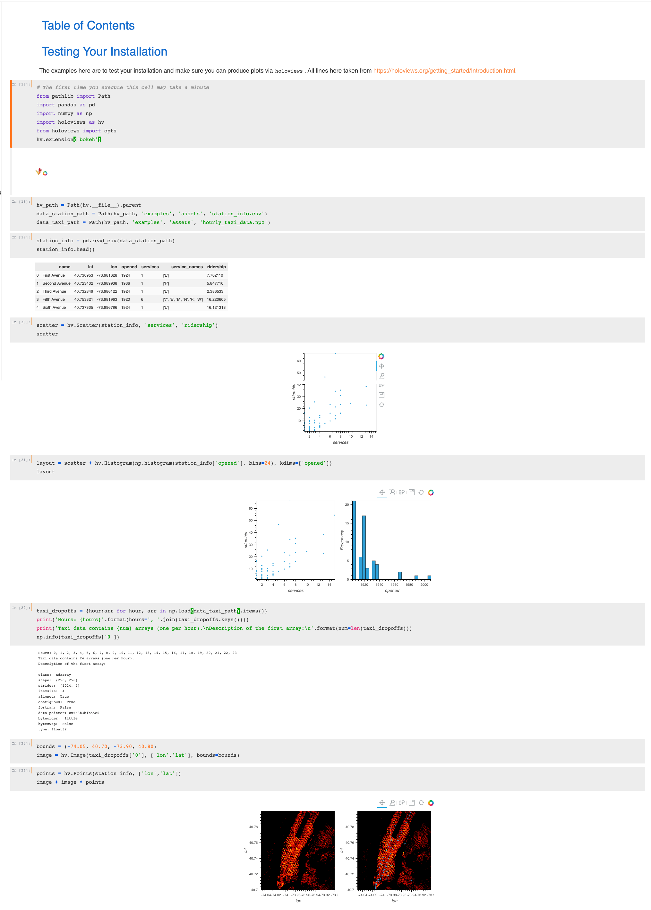

# Exploratory Data Science Course (Early Access Build!)
*Brian Pollack (brianleepollack@gmail.com)*

This is the first iteration of the Exploratory Data Science Course for students in DBMI.  Because this is a highly interactive and computer-dependent class, many things will go wrong!  If there are any issues, especially with the setup and install, please contact me!

## Setup and Installation
*Note: If you already have Anaconda installed on the PSC, you can skip ahead to cloning the github repo.*

### Log into PSC, install Anaconda
1. Login to PSC: `ssh -Y {your_username}@pghbio.bridges.psc.edu`
    - New to PSC?  Check out the user guides and info! https://www.psc.edu/bridges/user-guide
1. Check your projects and allocations:
    ```shell
    [userid@login018 ~]$ projects
     Your default charging project charge id is ABC0123456. If you would like to change the default charging project 
    use the command change_primary_group ~charge_id~. Use the charge id listed below for the project you would like 
    to make the default in place of ~charge_id~


    Project: XYZ654321D
    PI: My Principal Investigator
    Title: Important Research

        Resource: BRIDGES AI
      Allocation: 10,000.00
         Balance: 680.49
        End Date: 2030-07-15
    Award Active: Yes
     User Active: Yes
       Charge ID: ABC0123456
       *** Default charging project ***
     Directories:
         HOME /home/username

        Resource: BRIDGES LARGE MEMORY
      Allocation: 200,000.00
         Balance: 84,597.05
        End Date: 2030-07-15
    Award Active: Yes
     User Active: Yes
       Charge ID: ABC0123456
       *** Default charging project ***
     Directories:
         HOME /home/username

        Resource: BRIDGES PYLON STORAGE
      Allocation: 100,000.00
         Balance: 21,937.62
        End Date: 2030-07-15
    Award Active: Yes
     User Active: Yes
       Charge ID: ABC0123456
     Directories:
         Lustre Project Storage /pylon5/ABC0123456 
         Lustre Storage /pylon5/ABC0123456/username
    ```
1. Load into an interactive node: `interact -p {partition_name} --egress -t 02:00:00 -A {charge_id} --mem=120GB`
	1. If you have access to charge ID 'bi561ip', use partition name 'DBMI'.
	1. If you don't, use partition name 'RM' or 'RM-small'
1. Navigate to your large-space directory: `cd $SCRATCH`
1. Download and install Anaconda (https://www.anaconda.com/distribution/)
    ```shell
    [userid@login018 ~]$ curl -O https://repo.anaconda.com/archive/Anaconda3-2019.07-Linux-x86_64.sh
    [userid@login018 ~]$ bash Anaconda3-2019.07-Linux-x86_64.sh
    ```
1. Follow the on-screen instructions and allow Anaconda to modify your bashrc.
1. Log out and log back in, then type `conda list`.  If it displays a bunch of downloaded packages, congrats! You've done it!  If it doesn't and shows an error or `command not found`, then congrats! Something went wrong!

### Install the data science GitHub repo
1. **You must have anaconda installed before installing the packages for this repo!**
1. If you don't have a GitHub account, it's time to make one!
    1. Check out the instructions here: https://git-scm.com/book/en/v2/GitHub-Account-Setup-and-Configuration
1. Make sure you're in a large-space directory (`cd $SCRATCH`, for instance).
1. Can you access the `git` commands?  Type `git --version` to test it out. If not, load git via `module`:
    - `module load git`
1. Clone the data science repo: `git clone https://github.com/pollackscience/data_course`
1. `cd data_course`
1. Install the packages needed for this course.  This could take an hour or so: `conda env create -f environment.yml`
    1. This will create a virtual environment called 'data_course'.  We will need to activate this environment every time we log in if we want access to all the packages we just installed
    1. If there are any package conflicts, let me know!
1. Make sure you're in the new environment via `conda activate data_course`

### Running jupyter notebook and testing the install
1. Jupyter notebook is a great tool for doing data science, and we will be taking advantage of it during this course.
1. In order to use jupyter notebook while logged into PSC, we will need to tunnel a connection and forward a port.  This is handled via the `startupjupyter` script.  Try running it and following the instructions:
    ```shell
    [userid@login018 ~]$ helper_files/startupjupyter
    Your Jupyter Notebook is ready for use.
    ------------------------
    Step 1:
    Mac/Linux users: launch another terminal and paste the following command:
    ssh -L 9888:login018.opa.bridges.psc.edu:9888 bridges.psc.edu -l userid
    Windows users: run cmd then cd to yor PuTTY directory then pased the following command:
    plink  -L 9888:login018.opa.bridges.psc.edu:9888 bridges.psc.edu -l userid
    ------------------------
    Step 2: Open a browser on your computer to http://localhost:9888
    Step 3: Enjoy Jupyter Notebook!
    ```
1. Copy and paste the ssh command into a new window to allow port forwarding.  Then open a browser window and go to the localhost location shown above.
1. Once in notebook, navigate to "notebooks/" and open Course_0.ipynb
1. Execute all cells in the notebook (Shift-enter on each cell, or go to 'Cell -> Run All')
1. If all cells execute without throwing errors, and you can see plots, then you're good to go!



    


